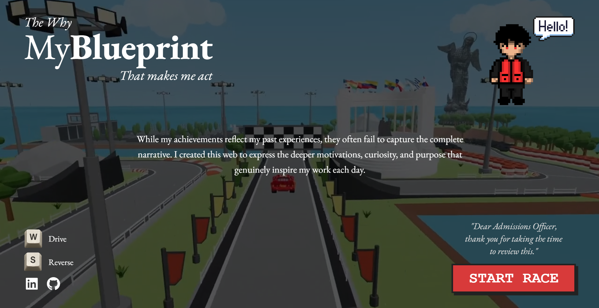

  <h1>🏎️ Adrián Garrido - College Portfolio</h1>
  
<i>An interactive, low-poly 3D web application designed for US Admissions Officers.</i>

  
  

 

  

---

## 🏁 Core Concept

Utilizing a racing telemetry metaphor, the project presents deep intellectual insights, leadership reflections, and personal growth across four distinct sectors (Academics, Mathematics, Coding, and Volunteering) rather than a flat list of achievements. 

  

## 💡 Details: "The Why, not What"

This portfolio is based entirely on who I am and what motivates me. 
It contains landmarks from my country and key hints to my hobbies and likings. The HUD resembles F1 games, while the car model is Lightning McQueen—making my passions very clear to give admissions officers a more authentic glimpse into who I am beyond the paper.

## 🛠️ Technical Architecture

*  **Engine:** Three.js (Vanilla JS) optimized for real-time 3D rendering of unified low-poly assets.
* ⌨️ **Controls & Navigation:** Constraint-based spline mechanics (`CatmullRomCurve3`) tied exclusively to `W/S` or Arrow keys to guarantee zero-friction exploration.
* 🎥 **Cinematics & UX:** Dual-camera matrix supporting an automated Third-Person Follow Mode, an interactive Orbit Inspection Mode, and a hidden Free Drone Mode.
* 📊 **Frontend UI:** High-contrast responsive HUD overlay rendering simulated speed metrics, lap tracking, and dynamic modal panels for content delivery.

## 🚀 Technologies Used

  
  
  
  

